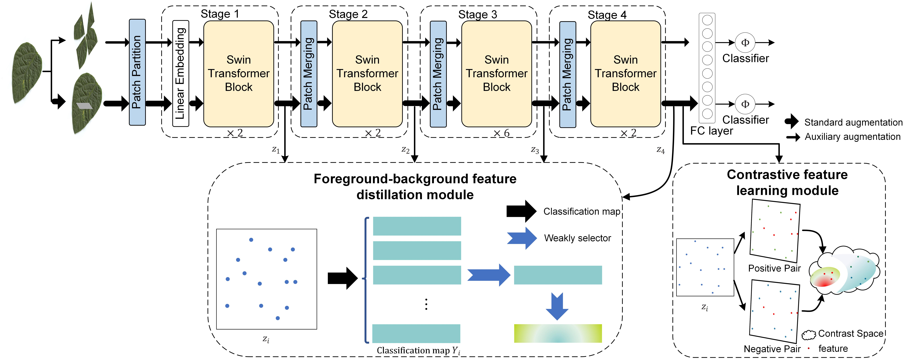

# sdkxd团队在叶片病害识别挑战赛的解决方案

叶病鉴定在农业中具有至关重要的地位，因为它有助于及早发现和管理植物病害，最终有助于提高农作物产量和粮食安全。近年来，随着计算机视觉和机器学习技术的不断进步，自动化叶病识别方法备受瞩目。本文介绍了一种名为VIT-FD的模型，该模型采用了一种创新的方法来提高叶病识别的准确性和可解释性。VIT-FD模型的总体框架如下所示。首先，输入的图像经过标准的增强处理和随机混洗和掩蔽操作，将图像投影到两个不同的视图中。这种处理有助于模型更好地捕捉叶子的特征。接下来，经过这两个视图的图像被送入神经网络的主干部分，进行特征提取。整个网络以端到端的方式进行训练，这意味着模型的各个部分能够协同工作以提高性能。值得注意的是，在推理阶段，自监督模块被分离，这有助于提高模型的效率。

该方法的一个重要创新点是前景-背景蒸馏（Foreground-Background Feature Distillation）策略。这一策略的核心思想是在训练过程中舍弃一些特征，以增加前景（叶子区域）和背景之间的差距。通过这种方式，模型更加关注叶子内的关键信息，减少了不相关背景噪声对叶病分类结果的影响。这不仅提高了模型的准确性，还增强了其可解释性，使人们能够更好地理解模型的决策过程。

另外，由于叶病的不同类别之间的差异非常小，简单的交叉熵损失不足以完全监督特征的学习。因此，该方法采用了对比损失，这种损失函数旨在最小化不同标签对应的分类标记的相似性，并最大化具有相同标签的样本的分类标记相似性。这有助于进一步提高模型在叶病识别任务中的性能。



## 1. 环境设置
+ CUDA==11.4
+ Python 3.9.12
+ pytorch==1.12.1
+ torchvision==0.12.0+cu113
+ tensorboard
+ scipy
+ ml_collections
+ tqdm
+ pandas
+ matplotlib
+ imageio
+ timm
+ yacs
+ scikit-learn
+ opencv-python

## 2. 数据处理
### 2.1. 生成数据集label
通过`rename.py`脚本把文件命名为”类名_文件名的格式“
```
python ./code/train/rename.py
```

然后，根据文件夹中的文件生成label
```
python ./code/train/gen_label.py
```

最后，把所有类别放入同一个文件夹中
```
find ./xfdata/叶片病害识别挑战赛训练集-复赛/ -type f -name "*.png" -exec mv {} ./xfdata/leaf_disease_new/images/ \;
```


## 3. 数据增强
首先将所有数据集的输入图像调整为600×600。然后在训练阶段，通过Randon Crop、Random HorizontalFlip、Random GaussianBlur和Normalization执行数据扩充，标准增强由上述转换组成。
而随机混洗和掩蔽在标准增强的基础上加入了RandomErasing。输入的图像经过标准的增强处理和随机混洗和掩蔽操作，将图像投影到两个不同的视图中。这种处理有助于模型更好地捕捉叶子的特征。
而在测试阶段，使用Center Crop和Normalizaion。


## 4. 训练

### 4.1. 下载预训练Swin Transformer模型

```
wget https://github.com/SwinTransformer/storage/releases/download/v1.0.0/swin_base_patch4_window7_224_22k.pth
```

### 4.2. 训练模型
使用shell脚本来训练模型
```
sh train.sh
```

## 5. 推理
使用shell脚本进行推理
```
sh test.sh
```