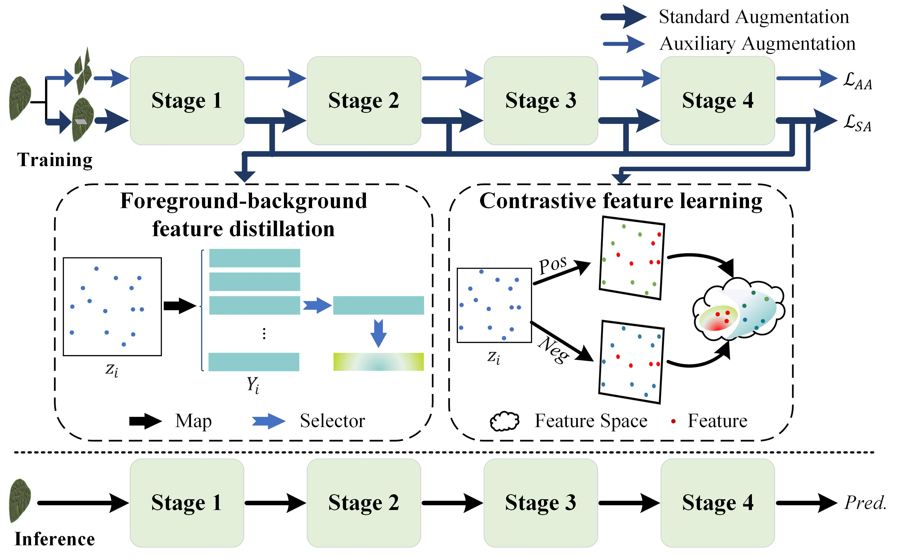

# Integrating foreground–background feature distillation and contrastive feature learning for ultra-fine-grained visual classification


This repository is the official implementation of the paper
[Integrating foreground–background feature distillation and contrastive feature learning for ultra-fine-grained visual classification](https://www.sciencedirect.com/science/article/abs/pii/S0031320324000906).


## Abstract
<div style="text-align:justify">
In pattern recognition, ultra-fine-grained visual classification (ultra-FGVC) has emerged as a paramount challenge, focusing on sub-category distinction within fine-grained objects. The near-indistinguishable similarities among such objects, combined with the dearth of sample data, intensify this challenge. In response, our FDCL-DA method is introduced, which integrates Foreground–background feature Distillation (FD) and Contrastive feature Learning (CL) with Dual Augmentation (DA). This method uses two different data augmentation techniques, standard and auxiliary augmentation, to enhance model performance and generalization ability. The FD module reduces superfluous features and augments the contrast between the principal entity and its backdrop, while the CL focuses on creating unique data imprints by reducing intra-class resemblances and enhancing inter-class disparities. Integrating this method with different architectures, such as ResNet-50, Vision Transformer, and Swin-Transformer (Swin-T), significantly improves these backbone networks, especially when used with Swin-T, leading to promising results on eight popular datasets for ultra-FGVC tasks.

</div>




## 1. Environmental settings
+ CUDA==11.4
+ Python 3.9.12
+ pytorch==1.12.1
+ torchvision==0.12.0+cu113
+ tensorboard
+ scipy
+ ml_collections
+ tqdm
+ pandas
+ matplotlib
+ imageio
+ timm
+ yacs
+ scikit-learn
+ opencv-python


## 2. Download the pre-trained Swin Transformer models

```
wget https://github.com/SwinTransformer/storage/releases/download/v1.0.0/swin_base_patch4_window7_224_22k.pth
```
## 3. Download Datasets
You can download the datasets from the links below:

+ [Cotton80, SoyLocal, SoyGlobal, SoyGene, and SoyAgeing](https://maxwell.ict.griffith.edu.au/cvipl/UFG_dataset.html).


## 4. Loading data
If the result is the directory below, use **ImageDataset()** in `./data/build.py `to load the dataset

    ./datasets/soybean_gene/
    ├── classA
    ├── classA
    ├── ...
    └── classN

If the result is the directory below, use **Cultivar()** in `./data/build.py` to load the dataset

    ./datasets/soybean_gene/
    └── anno
       ├── train.txt
       └── test.txt
    └──images
       ├── ImageA
       ├── ImageB
       ├── ...
       └── ImageN

## 5. Training
Using the scripts on scripts directory to train the model, e.g., train on SoybeanGene dataset.

```
sh ./scripts/run_gene.sh
```

## 6. Evaluation
Using the scripts on scripts directory to evaluate the model, e.g., evaluate on SoybeanGene dataset.

```
sh ./scripts/test_gene.sh
```